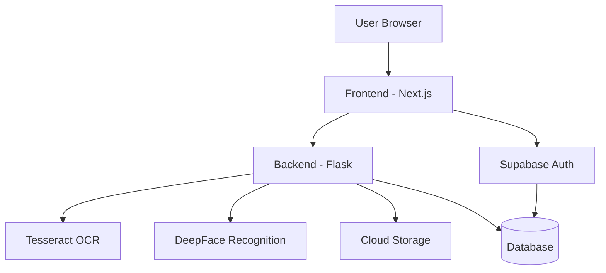
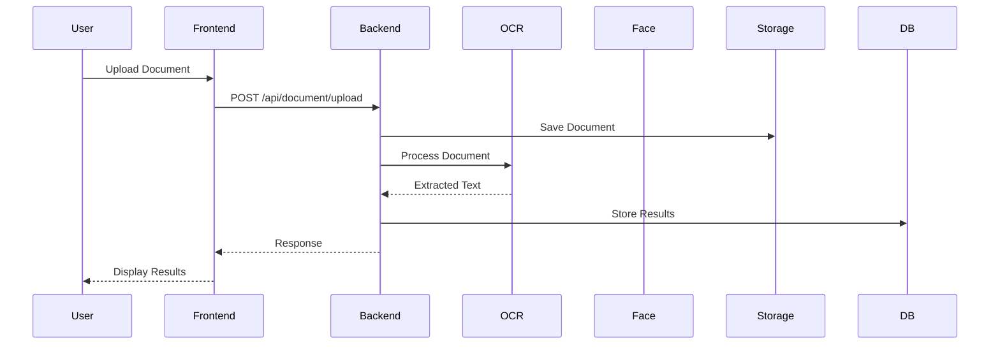

# Loanly - AI-Powered Video-Based Loan Assistance Platform

## 📌 Table of Contents

1. [Overview](#overview)
2. [Solution Breakdown](#solution-breakdown)
3. [Architecture](#architecture)
4. [Features](#features)
5. [Tech Stack](#tech-stack)
6. [Setup Instructions](#setup-instructions)
7. [Project Structure](#project-structure)
8. [API Documentation](#api-documentation)
9. [Development Guidelines](#development-guidelines)
10. [Testing](#testing)
11. [Deployment](#deployment)
12. [Contributing](#contributing)
13. [License](#license)
14. [Hackathon Submission](#hackathon-submission)

---

## 🚀 Overview

Loanly is an AI-driven digital banking assistant designed to revolutionize the loan application process by enabling **interactive video-based consultations and automated document verification**. Developed for the **Standard Chartered Hackathon 2025**, this platform replicates the in-person banking experience, providing customers with a seamless, remote loan application process.

### 🔑 Key Features

✔️ **AI Virtual Branch Manager** – Engages users through structured, pre-recorded video interactions\
✔️ **Video-Based Customer Interaction** – Allows users to submit video responses instead of lengthy forms\
✔️ **Automated Document Processing** – Utilizes OCR to extract data from Aadhaar, PAN, and income proofs\
✔️ **Loan Eligibility Assessment** – Implements a rule-based decision system for real-time loan evaluation\
✔️ **Multi-Language Support** – Provides pre-recorded assistant videos in multiple languages\
✔️ **Instant Feedback System** – Offers immediate approval, rejection, or additional document requests

---

## 🏦 Solution Breakdown

### 1️⃣ AI Virtual Branch Manager

- Uses pre-recorded video dialogues to guide applicants through the loan process
- Asks structured financial questions to assess eligibility
- Simulates a real-world banking experience through interactive video prompts

### 2️⃣ Video-Based Customer Interaction

- Provides a **secure video recording interface** for submitting responses
- Implements **real-time facial verification** to ensure session continuity
- Ensures user authentication throughout the loan application process

### 3️⃣ Automated Document Processing

- Supports multiple document types (**Aadhaar, PAN, income proof, etc.**)
- Extracts key details via **OCR-based data processing** (Tesseract OCR)
- Ensures secure cloud storage and data encryption for privacy

### 4️⃣ Loan Eligibility & Decisioning

- Uses a **rule-based eligibility engine** for fast decision-making
- Evaluates income, employment status, and credit risk factors
- Provides real-time loan status: ✅ Approved | ❌ Rejected | 🔄 More Info Needed

### 5️⃣ Multi-Language Support (Optional Enhancement)

- Offers video assistance in **multiple Indian languages**
- Supports **dynamic language switching** for an inclusive user experience

---

## 🔧 Architecture

### **System Architecture**



### **Data Flow**



---

## 💡 Features

✅ **Automated OCR Document Processing** – Extracts and validates document data\
✅ **Video-Based Identity Verification** – Ensures security through facial recognition\
✅ **Real-Time Loan Eligibility Assessment** – Provides instant feedback on applications\
✅ **User-Friendly Interface** – Offers a clean, modern, and responsive design

---

## 🛠 Tech Stack

### **Frontend**

- Next.js 15.2.2
- React 19
- TailwindCSS
- Supabase Auth
- Face-API.js

### **Backend**

- Flask 2.3.3 (Python 3.12+)
- Tesseract OCR
- OpenCV + DeepFace (Facial Recognition)
- JWT Authentication

### **Infrastructure**

- Supabase for authentication
- Cloud Storage for video and documents
- CORS-enabled architecture

---

## 📌 Setup Instructions

### **Prerequisites**

- Python 3.12+
- Node.js 18+
- Tesseract OCR
- Git

### **Backend Setup**

```bash
cd backend
python -m venv venv
source venv/bin/activate  # On Windows: venv\Scripts\activate
pip install -r requirements.txt
python run.py
```

### **Frontend Setup**

```bash
cd frontend
npm install
npm run dev
```

---

## 📂 Project Structure

```
backend/
├── app/
│   ├── routes/
│   │   ├── document_routes.py
│   │   ├── video_routes.py
│   ├── services/
│   ├── utils/
├── static/uploads/
└── run.py
```

```
frontend/
├── components/
├── pages/
├── lib/
├── public/
└── package.json
```

---

## 📜 API Documentation

### **Document Routes**

- `POST /api/document/upload` – Upload & process document
- `GET /api/document/documents/<document_id>` – Retrieve document details

### **Video Routes**

- `POST /api/video/upload` – Upload & store user response
- `POST /api/video/verify` – Verify user’s face

---

## ✅ Development Guidelines

- **Python Code Style:** PEP 8
- **JavaScript Code Style:** ESLint
- **Git Workflow:** Feature branches, PRs, and code reviews

---

## 🧪 Testing

### **Backend**

```bash
cd backend
python -m pytest
```

### **Frontend**

```bash
cd frontend
npm test
```

---

## 🚀 Deployment

### **Backend**

```bash
pip install gunicorn
gunicorn -w 4 -b 0.0.0.0:8000 run:app
```

### **Frontend**

```bash
npm run build
npm start
```

---

## 🏆 Hackathon Submission

### 📹 **Demo Video Includes**

1. AI Branch Manager interaction
2. Video-based customer authentication
3. Document upload and processing
4. Loan eligibility assessment
5. Multi-language support demonstration

### &#x20;📝 Presentation Structure

1. **Problem Statement & Solution Overview** – Defining the core issue and how Loanly addresses it.
2. **Technical Architecture & Implementation** – Analyzing the system’s design and underlying technologies.
3. **Key Features & Innovations** – Highlighting the unique aspects and technical advancements of the project.
4. **User Experience & Interface** – Demonstrating how the platform ensures seamless user interactions.
5. **Future Enhancements & Scalability** – Exploring potential improvements and long-term viability.

---

## 📜 License

This project is licensed under the **MIT License**.

---

